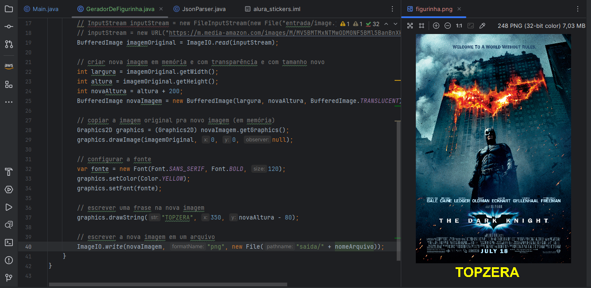

# Imersão Java: edições 1 e 2

### Aula 01 - Consumindo uma API de filmes com Java
Nesta primeira aula, foi explorado como construir uma aplicação do zero para consumir a API do IMDb e exibir os filmes mais populares, destacando seus pôsteres e visualizando sua classificação.

### Aula 02 - Gerando figurinhas para WhatsApp
Nesta segunda aula vimos como criar um gerador de figurinhas explorando outras bibliotecas nativas do Java, para que possamos enviar por Whatsapp os nossos filmes preferidos!

