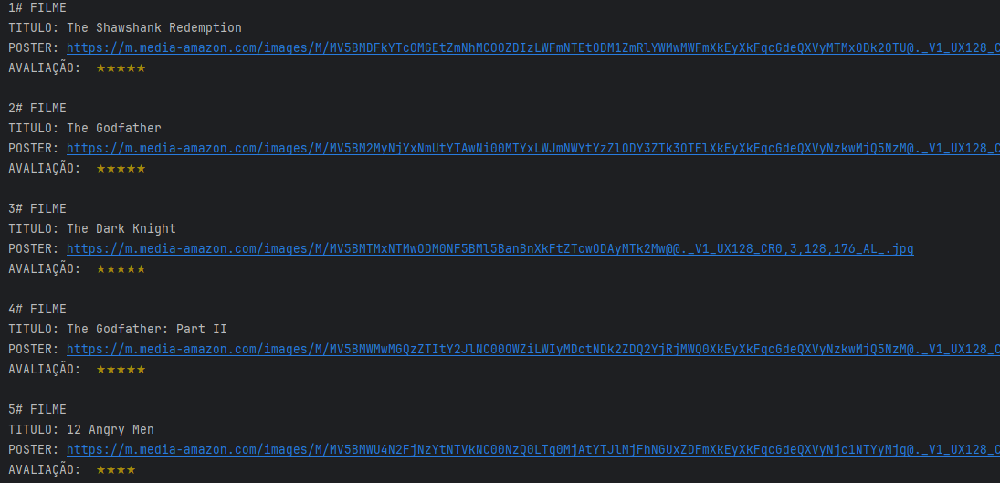

# Imersão Java: edições 1 e 2

### Aula 01 - Consumindo uma API de filmes com Java
Boas-vindas! Chegou a hora de mergulhar em Java com a primeira Imersão Java da Alura!

Nesta primeira aula, vamos construir uma aplicação do zero para consumir a API do IMDb e exibir os filmes mais populares, destacando seus pôsteres e visualizando sua classificação.

